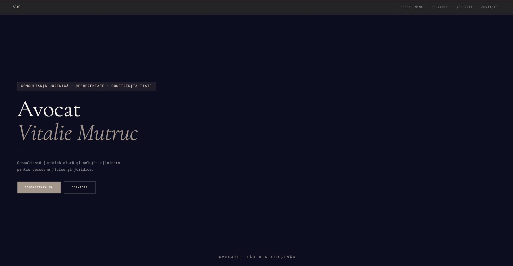
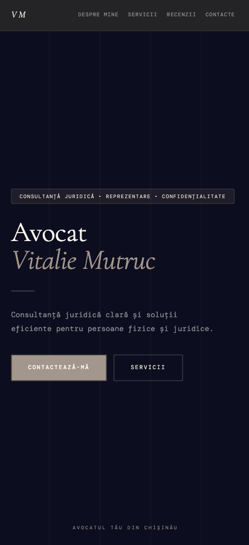
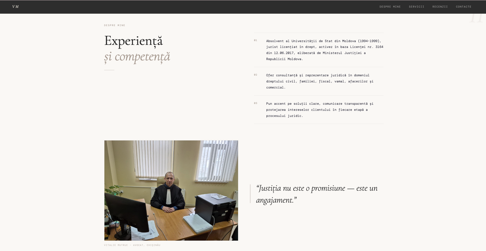
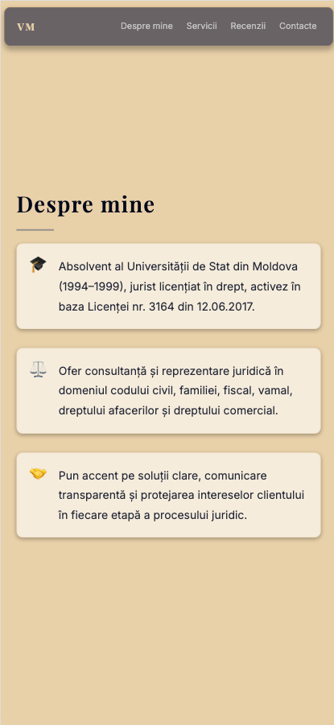
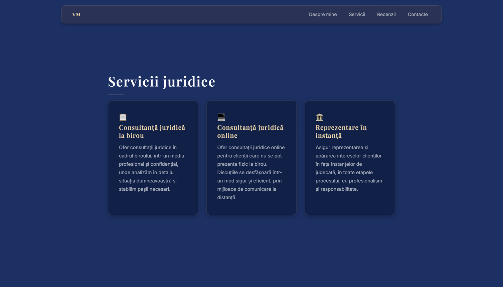
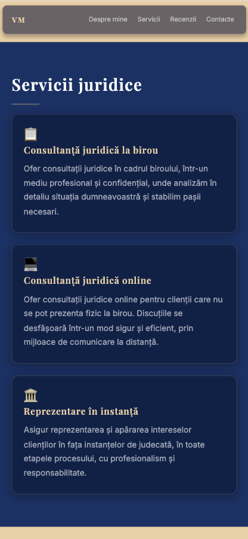
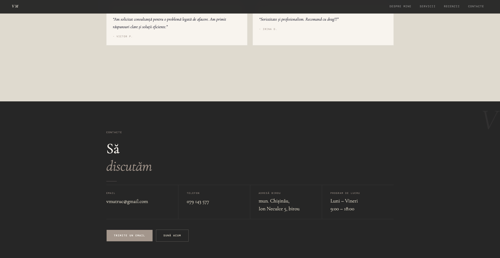
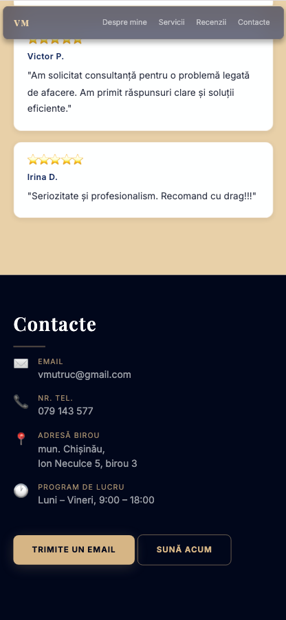

# Lab 2 - Landing page

## Description

This project represents a landing page for an individual lawyer - Vitalie Mutruc. The website provides clear information about the legal services offered, professional background, reviews and contact details.
The page is built using HTML and vanilla CSS.

## Features
* Navigation bar with scrolling between sections
* Hero section with Call to Action
* About section
* Services section 
* Reviews section
* Contact section
* Responsive design

## Screenshots
* Hero section with Navbar in Desktop view

    

* Hero section with Navbar in Mobile view

  

* About section in Desktop view

    

* About section in Mobile view

    

* Services section in Desktop view

    

* Services section in Mobile view

    

* Reviews section in Desktop view

    

* Reviews section in Mobile view

    

* Contact section in Desktop view

    

* Contact section in Mobile view

    

## Link to website
The website is available at: https://victoriaaa111.github.io/tum-web-lab2/

