# Lab 2 - Landing page

## Description

This project represents a landing page for an individual lawyer - Vitalie Mutruc. The website provides clear information about the legal services offered, professional background, reviews and contact details.
The page is built using HTML, TailwindCSS and CSS.

## Features
* Navigation bar with scrolling between sections
* Hero section with Call to Action
* About section
* Services section 
* Reviews section
* Contact section
* Responsive design

## Screenshots
* Hero section with Navbar in Desktop view

    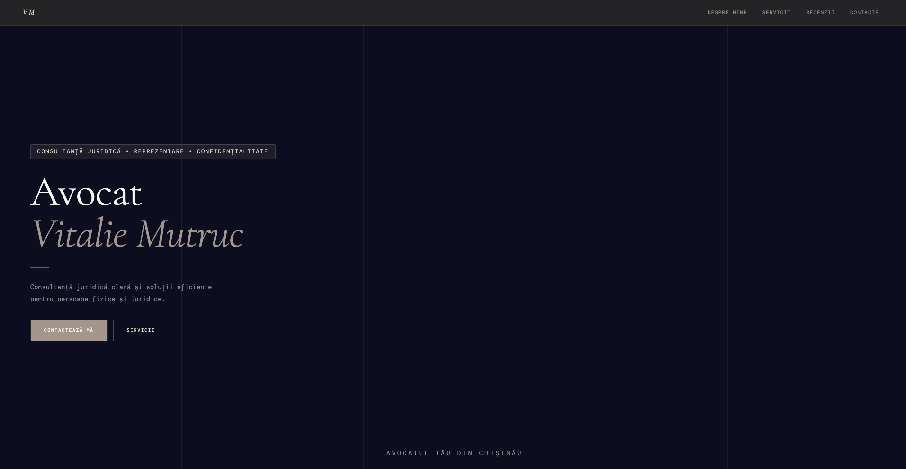

* Hero section with Navbar in Mobile view

  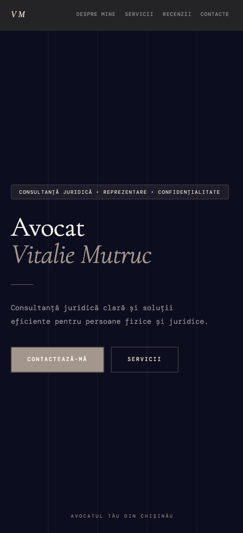

* About section in Desktop view

    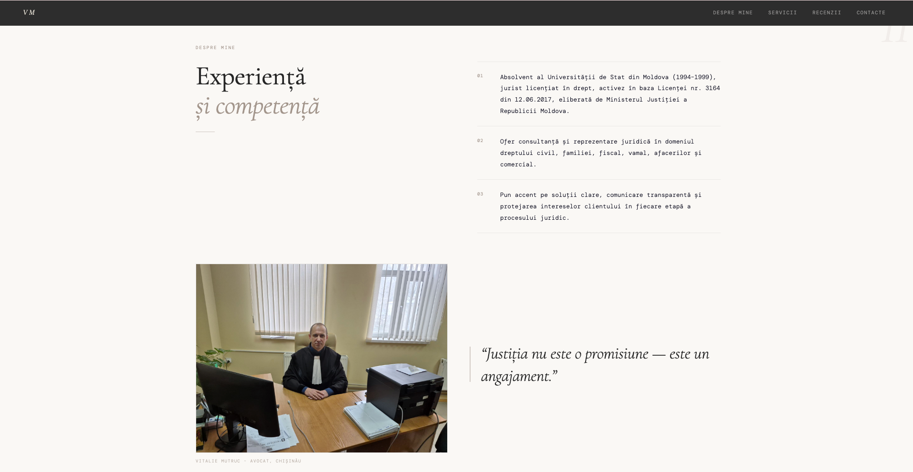

* About section in Mobile view

    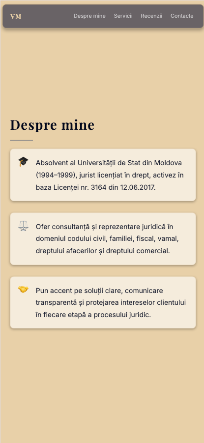
    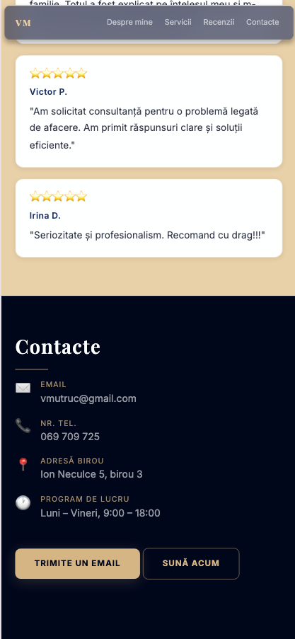

* Services section in Desktop view

    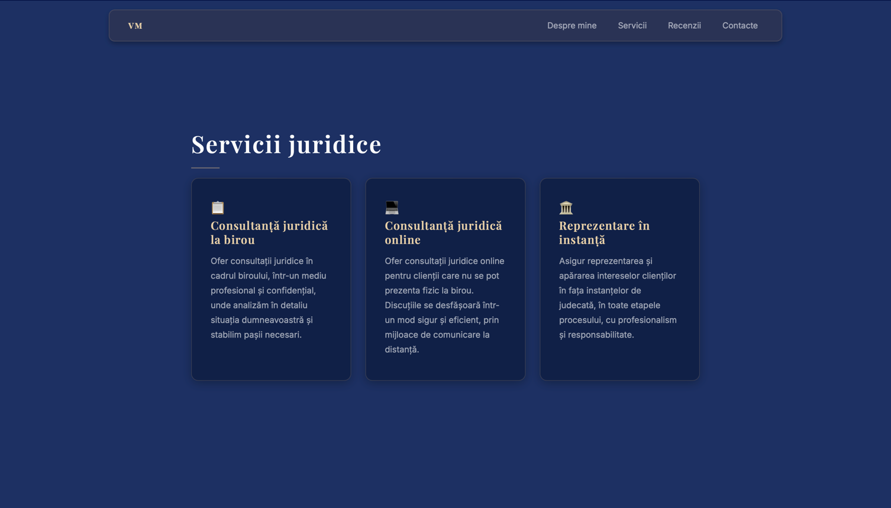

* Services section in Mobile view

    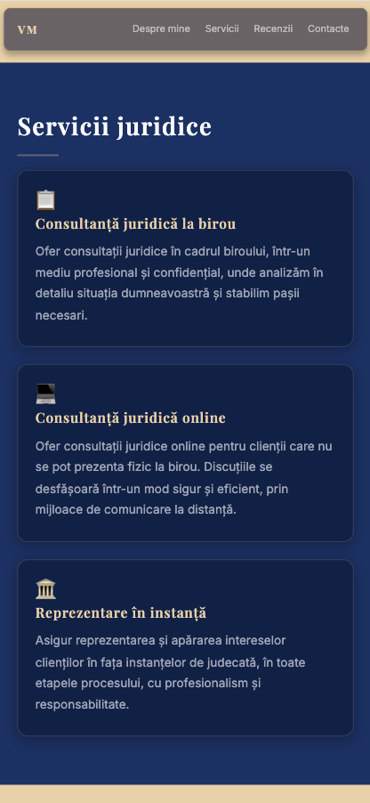

* Reviews section in Desktop view

    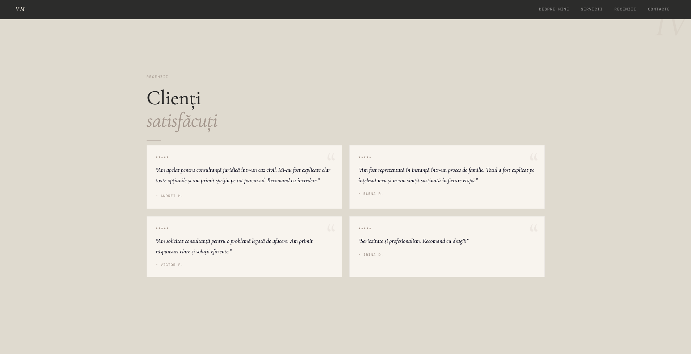

* Reviews section in Mobile view

    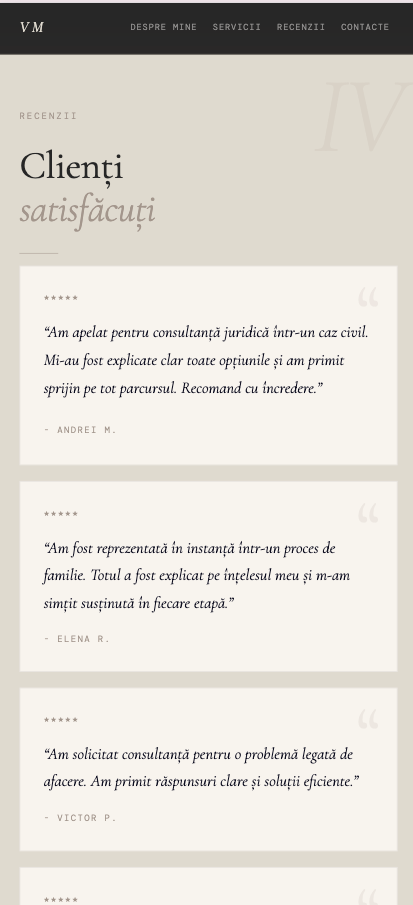

* Contact section in Desktop view

    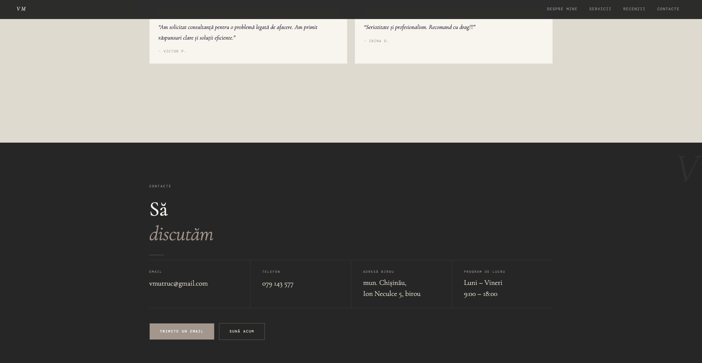

* Contact section in Mobile view

    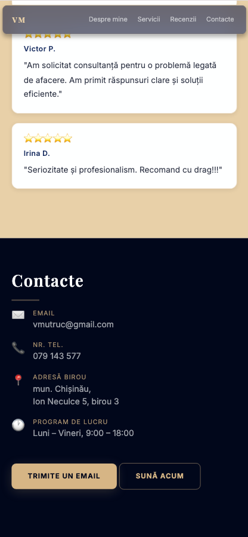

# Lab 3 - Mascot + CSS Framework + Mobile-first

## Lab 3 tasks
* Adjusted all element sizes for desktop and mobile viewports
* Made the Call to Action visible on mobile screens

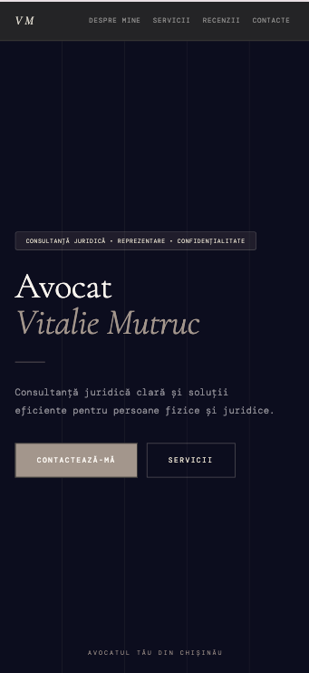

* Added a mobile-only **"Sună-mă"** button for quick contact

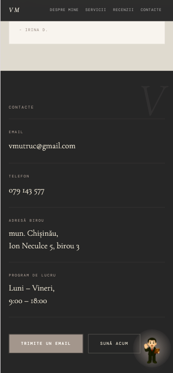

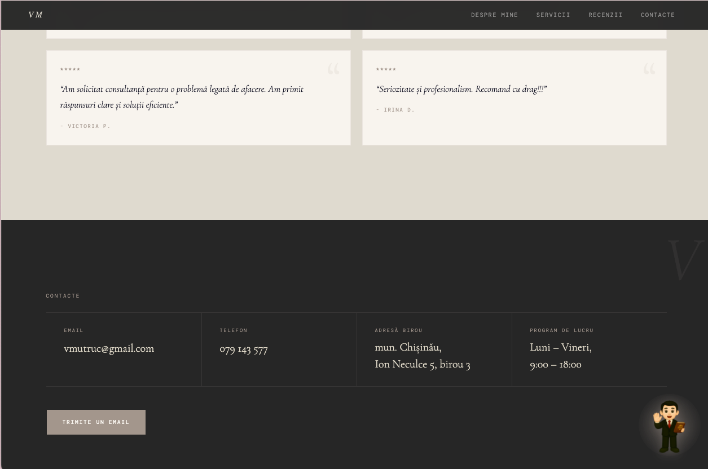

* Added an animated lawyer mascot that appears after a delay at page corners/borders

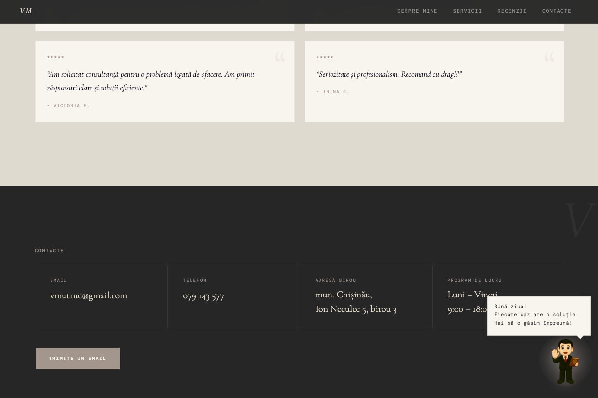

* Implemented mascot animations: floating, appear/disappear transitions, and a glowing background effect 
* Displayed a welcome tooltip message on mascot hover 
* Migrated the Contact, About Me, Services and Reviews sections to **TailwindCSS**

# Lab 4 - CMS + SSG

## Lab 4 tasks
* Migrated the landing page to **Astro** (Static Site Generator)
* Integrated **Decap CMS** for Git-based content editing

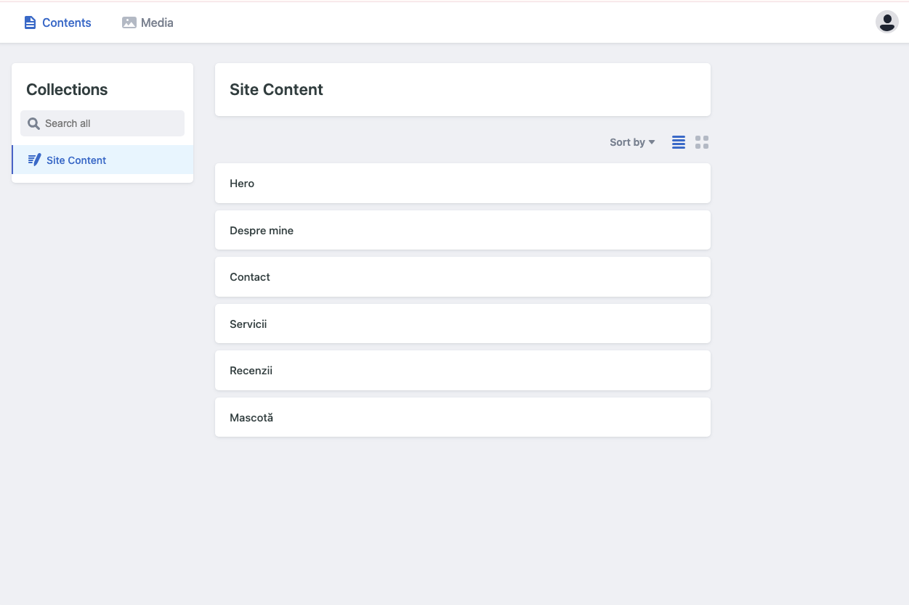

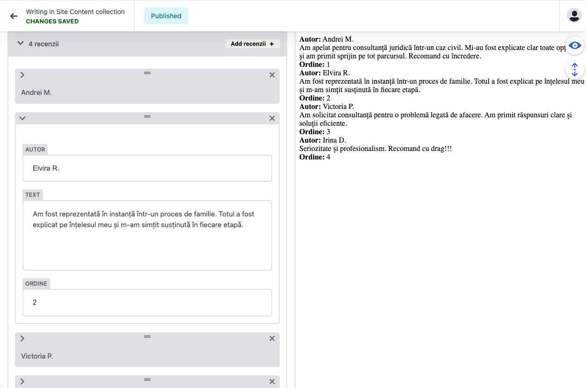

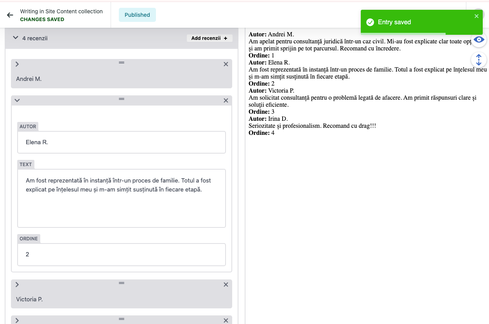

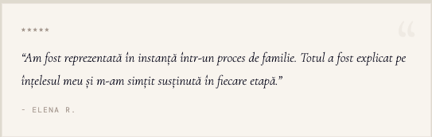

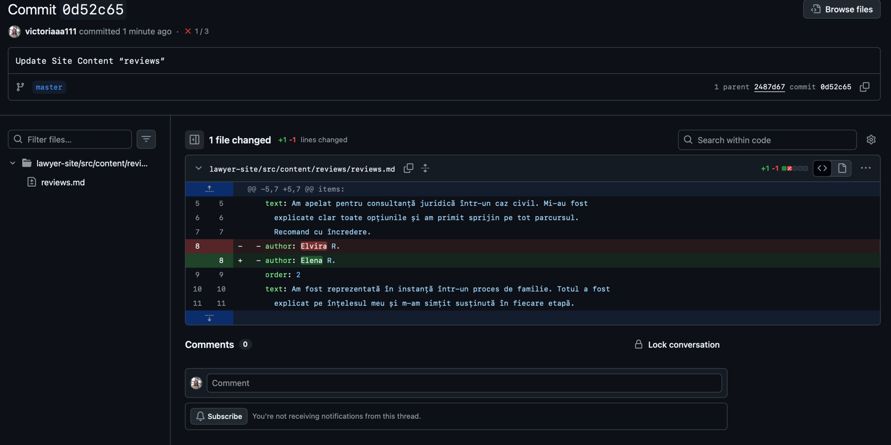

* Ensured TailwindCSS styling from Lab 3 is properly carried over into the Astro project

## Website link: https://avocatmutruc.netlify.app/
